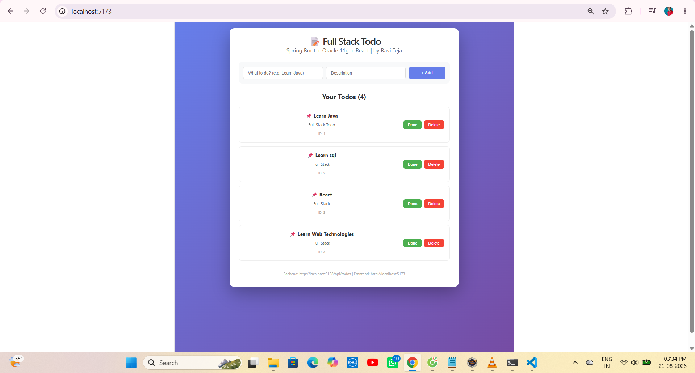
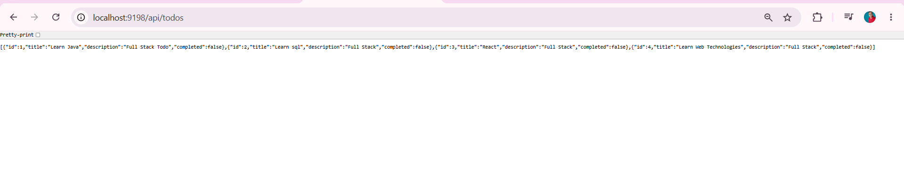
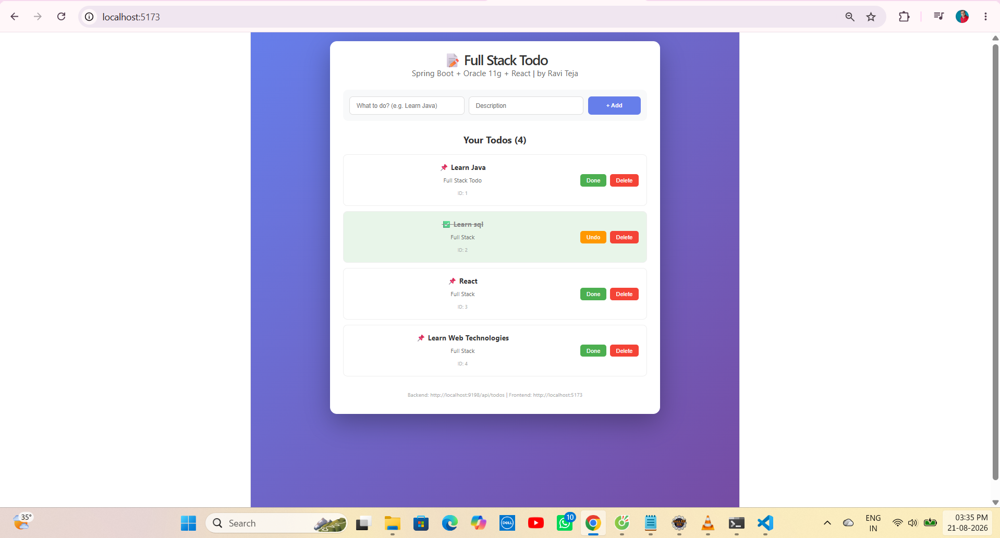
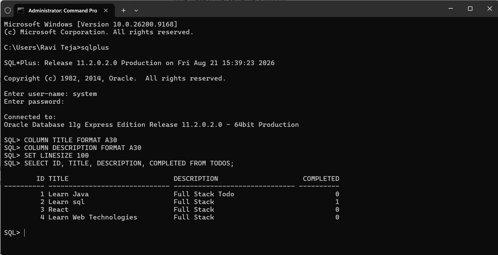

# ✅ Project 63 – Full Stack Todo App + Oracle 11g | Spring Boot + React | Single Repo

<p align="left">


</p>

---

# 📖 Project Overview

**Full Stack Todo App + Oracle 11g** is **Project 63** of **Tier 7 – Full Stack Mastery with Oracle**, developed using **React 19**, **Spring Boot 3.3.3**, **Oracle 11g XE**, **Spring Data JPA**, **Hibernate**, and **Axios** in a single monorepo.

React frontend runs on **port 5173** and communicates with the Spring Boot REST API running on **port 9198** through Axios.

The backend provides REST endpoints for:

- `GET /api/todos/test`
- `GET /api/todos`
- `POST /api/todos`
- `PUT /api/todos/{id}`
- `DELETE /api/todos/{id}`

The frontend displays:

- Full Stack Todo header
- Spring Boot + Oracle 11g + React | by Ravi Teja label
- Add Todo input (Title + Description)
- Your Todos counter
- Todo cards with Done/Undo & Delete
- Completed status with green highlight
- ID badge
- Footer with Backend & Frontend URLs

This project uses a **single repository architecture** containing both backend and frontend with **Oracle 11g persistence**.

---

# ✨ Features

## 🧭 Header

- Full Stack Todo branding
- Spring Boot + Oracle 11g + React label
- By Ravi Teja
- Gradient purple background

## 📝 Add Todo

- Title input
- Description input
- + Add button
- Axios POST API
- Validation for empty title

## 📋 Todo List

- Display all todos from Oracle
- ID: 1,2,3,4...
- Title + Description
- Completed status
- Real-time fetch via Axios GET

## ✅ Complete / Undo

- Done button → marks COMPLETED = 1 in Oracle
- Undo button → marks COMPLETED = 0 in Oracle
- Green highlight for completed
- Line-through for completed title
- Axios PUT API

## 🗑 Delete

- Delete button
- Axios DELETE API
- Removes from Oracle TODOS table

## 🗄 Oracle Integration

- Oracle 11g XE Database
- TODOS table auto-created by Hibernate
- SQL*Plus verification
- COMPLETED column (0 = pending, 1 = done)

---

# 🛠 Technologies Used

| Technology | Version |
|---|---|
| React | 19.0.0 |
| Vite | 8.2.2 |
| Java | 21 |
| Spring Boot | 3.3.3 |
| Oracle Database | 11g XE |
| Spring Data JPA | 3.3.3 |
| Hibernate | 6.5+ |
| Axios | 1.6+ |
| Maven | 3.9+ |
| SQL*Plus | 11.2.0.2.0 |

---

# 📂 Project Structure

```text
63-full-stack-todo/
│
├── backend/
│   └── 63-full-stack-todo-backend/
│       ├── src/main/java/com/raviteja/todo/
│       │   ├── TodoApplication.java
│       │   ├── model/
│       │   │   └── Todo.java
│       │   ├── repository/
│       │   │   └── TodoRepository.java
│       │   └── controller/
│       │       └── TodoController.java
│       ├── src/main/resources/
│       │   └── application.properties
│       └── pom.xml
│
├── frontend/
│   └── frontend/
│       ├── public/
│       ├── src/
│       │   ├── App.jsx
│       │   ├── App.css
│       │   ├── main.jsx
│       │   └── index.css
│       ├── package.json
│       ├── vite.config.js
│       └── node_modules/
│
├── screenshots/
│   ├── demo1.png
│   ├── demo2.png
│   ├── demo3.png
│   └── demo4.png
│
├── .gitignore
└── README.md
```

---

# ▶ How to Run

## 1. Clone Repository

```bash
git clone https://github.com/raviteja-dev950/63-full-stack-todo.git
cd 63-full-stack-todo
```

## 2. Oracle Database Setup

Start Oracle 11g XE Listener:

```bash
sqlplus system/your_password
```

No manual table creation needed - Hibernate auto creates TODOS table.

## 3. Backend

`src/main/resources/application.properties`:

```properties
server.port=9198
spring.datasource.url=jdbc:oracle:thin:@localhost:1521:xe
spring.datasource.username=system
spring.datasource.password=your_password
spring.datasource.driver-class-name=oracle.jdbc.OracleDriver
spring.jpa.hibernate.ddl-auto=update
spring.jpa.show-sql=true
spring.jpa.properties.hibernate.dialect=org.hibernate.dialect.OracleDialect
```

Run:

```text
Run As → Spring Boot App
```

Backend:

```text
http://localhost:9198/api/todos
```

## 4. Frontend

```bash
cd frontend
npm install
npm install axios
npm run dev
```

Frontend:

```text
http://localhost:5173
```

## 5. Axios

```javascript
import axios from "axios";

const API_URL = "http://localhost:9198/api/todos";

const fetchTodos = async () => {
  const res = await axios.get(API_URL);
  setTodos(res.data);
};

export default API_URL;
```

---

# 🔄 Application Flow

```text
User
 │
 ▼
React UI (5173)
 │
 ├── Add Todo (Title + Description)
 ├── Todo List
 ├── Done / Undo Toggle
 └── Delete Todo
 │
 ▼
Axios (GET, POST, PUT, DELETE)
 │
 ▼
Spring Boot API (9198)
 │
 ├── GET /api/todos → List all
 ├── POST /api/todos → Create
 ├── PUT /api/todos/{id} → Update completed
 ├── DELETE /api/todos/{id} → Delete
 └── GET /api/todos/test → Health check
 │
 ▼
Spring Data JPA + Hibernate
 │
 ▼
Oracle 11g XE (TODOS Table)
 │
 ├── ID NUMBER (PK)
 ├── TITLE VARCHAR2(255)
 ├── DESCRIPTION VARCHAR2(255)
 └── COMPLETED NUMBER(1) (0/1)
 │
 ▼
SQL*Plus Verification
```

---

# 📊 Statistics

| Item | Value |
|---|---:|
| Total Todos | 4 |
| Completed | 1 |
| Pending | 3 |
| Backend Port | 9198 |
| Frontend Port | 5173 |
| Database | Oracle 11g XE |
| Tier Progress | 1/10 (Tier 7 Start) |

---

# ✅ Default Todos

| ID | Title | Description | Completed |
|---:|---|---|:---:|
| 1 | Learn Java | Full Stack Todo | 0 |
| 2 | Learn sql | Full Stack | 1 |
| 3 | React | Full Stack | 0 |
| 4 | Learn Web Technologies | Full Stack | 0 |

---

# 🧪 API Testing

## Test API

```bash
curl http://localhost:9198/api/todos/test
```

## All Todos

```bash
curl http://localhost:9198/api/todos
```

## Add Todo

```bash
curl -X POST http://localhost:9198/api/todos -H "Content-Type: application/json" -d "{\"title\":\"Learn Java\",\"description\":\"Full Stack Todo\",\"completed\":false}"
```

## Update Todo (Toggle Done)

```bash
curl -X PUT http://localhost:9198/api/todos/2 -H "Content-Type: application/json" -d "{\"id\":2,\"title\":\"Learn sql\",\"description\":\"Full Stack\",\"completed\":true}"
```

## Delete Todo

```bash
curl -X DELETE http://localhost:9198/api/todos/1
```

---

# 📡 API Endpoints

| Method | Endpoint | Description |
|---|---|---|
| GET | `/api/todos/test` | Health Check |
| GET | `/api/todos` | Get All Todos |
| POST | `/api/todos` | Create New Todo |
| PUT | `/api/todos/{id}` | Update Todo (Toggle Completed) |
| DELETE | `/api/todos/{id}` | Delete Todo |

---

# 📦 Expected Test Response

```text
TODO API WORKING 63!
```

# 📊 Expected All Todos Response

```json
[
  {"id":1,"title":"Learn Java","description":"Full Stack Todo","completed":false},
  {"id":2,"title":"Learn sql","description":"Full Stack","completed":true},
  {"id":3,"title":"React","description":"Full Stack","completed":false},
  {"id":4,"title":"Learn Web Technologies","description":"Full Stack","completed":false}
]
```

# 🗄 Expected SQL Response

```sql
SQL> SELECT ID, TITLE, DESCRIPTION, COMPLETED FROM TODOS;

 ID TITLE                      DESCRIPTION         COMPLETED
---- -------------------------- ------------------- ----------
  1 Learn Java                 Full Stack Todo              0
  2 Learn sql                  Full Stack                   1
  3 React                      Full Stack                   0
  4 Learn Web Technologies     Full Stack                   0
```

---

# 📸 Screenshots

### 1. Backend API JSON Response (localhost:9198/api/todos)


### 2. Frontend UI - All Todos Pending (localhost:5173)


### 3. Frontend UI - One Completed with Green Highlight


### 4. Oracle 11g SQL*Plus Verification

---

# 🎯 Learning Outcomes

- Spring Boot REST APIs with Oracle 11g
- React 19 + Vite 8.2.2 Frontend
- Axios Integration (GET, POST, PUT, DELETE)
- Spring Data JPA & Hibernate DDL Auto
- Oracle Dialect Configuration
- Oracle XE Connection & SQL*Plus
- Full Stack CRUD Operations
- CORS Configuration
- Monorepo Architecture
- Frontend-Backend-Database Flow
- Real Database Persistence Verification

---

# 🚀 Future Enhancements

- Edit Todo Feature
- Search & Filter Todos
- Todo Categories
- Due Dates & Priority
- JWT Authentication
- User-specific Todos
- Pagination
- Spring Security
- Deployment on Render / Railway
- Frontend on Vercel / Netlify
- Oracle Cloud Deployment

---

# 👨💻 Author

**Ravi Teja**

Java Full Stack Developer

100 Java Full Stack Projects Challenge

**Project 63 / 100**

Tier 7 – Full Stack Mastery with Oracle (Started!)

---

# ⭐ Support

If you found this project helpful, consider giving it a ⭐ Star on GitHub.

## Single Repo

```text
https://github.com/raviteja-dev950/63-full-stack-todo
```

## Backend

```text
backend/63-full-stack-todo-backend/
Port: 9198
Database: Oracle 11g XE
```

## Frontend

```text
frontend/
Port: 5173
Framework: React 19 + Vite
```
